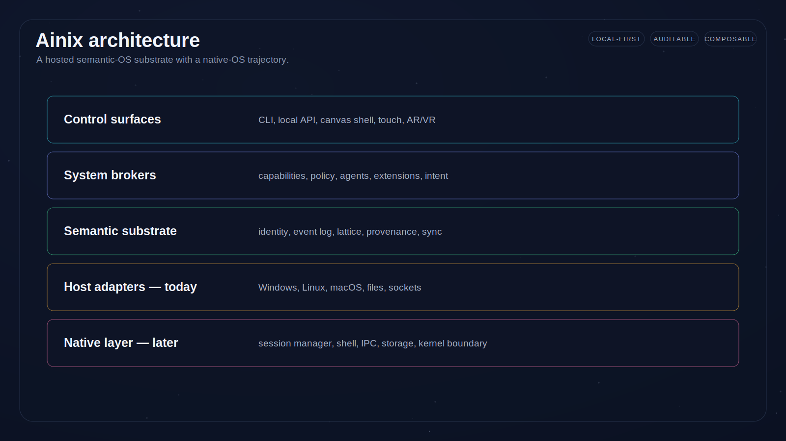
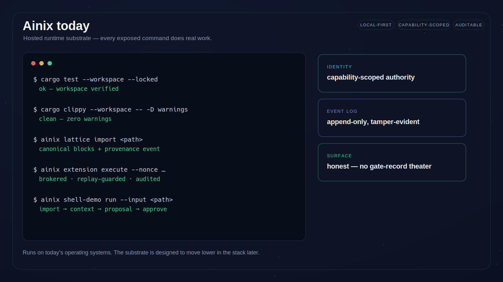
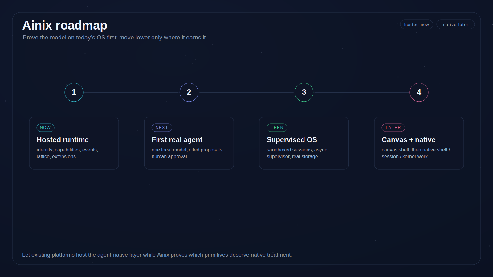

# Ainix

**An operating system for the agent-native era.**

Ainix is a long-range project to rethink personal computing around local
sovereignty, explicit authority, provenance, semantic context, and collaboration
between people and software agents. It is an early-stage research prototype, and
this public repository shares the direction, architecture, and concept work while
the implementation matures privately.

## The idea

Modern operating systems were designed around files, apps, windows, processes,
and devices. Those primitives still matter, but they are no longer enough for a
world where agents can read, reason, plan, act, and coordinate on a user's
behalf. When an agent summarizes a document, drafts a plan, edits a repository,
or invokes a tool, the user needs to know:

- what context the agent used,
- what authority it had,
- what it changed and why,
- which model or tool produced the output,
- whether private data left the machine,
- and how to approve, reject, undo, or audit the action.

Ainix treats those as **operating-system concerns, not application features**.
Its long-term interface is an infinite semantic canvas — where projects, files,
notes, agents, claims, citations, and approvals are connected objects rather than
scattered application windows — projected over a runtime that makes every action
authoritative and every artifact traceable.

## What Ainix treats as primitives

- **Cryptographic identity & delegated authority** — users, devices, agents, and
  shared spaces are first-class actors.
- **Capability-scoped agents & extensions** — no ambient authority; actors
  operate through explicit grants over specific resources.
- **Append-only event provenance** — meaningful actions are recorded so users can
  inspect what happened and why.
- **Canonical data (primblocks)** — a byte-exact, content-addressed base-truth
  layer: source files import to deterministic blocks and export back identically,
  with adversarial path/symlink safety and identity that ignores volatile
  filesystem metadata. Everything derived stays rebuildable from it.
  See [primblocks](docs/architecture/primblocks.md).
- **Semantic lattice** — versioned, queryable, provenance-rich knowledge state,
  built over those canonical records.
- **Local-first operation** — starts without a cloud account and keeps private
  work on the user's machine by default.
- **Model-aware policy** — local and remote models are governed by privacy class,
  scope, cost, and network authority.
- **A canvas/shell model** — a spatial workspace for humans, agents, tools, and
  knowledge.

## What is real today

The current implementation is a Rust userspace runtime that runs **on top of
existing operating systems**. This stage proves the model before taking on
kernel, driver, or compositor work. Working today, internally:

- a local `ainix` runtime and CLI for identity, capabilities, event provenance,
  lattice import/query, canvas records, agents, extensions, devices, and sessions;
- canonical, byte-preserving import of source files before any derived semantic
  state, so derived state stays rebuildable and auditable;
- typed broker boundaries for runtime operations, with append-only event
  verification;
- a hosted canvas-shell UI prototype that renders brokered state, provenance
  references, and proposal → approval → apply flows (rather than direct mutation);
- a single-executable demo that imports a file, builds semantic context, projects
  it into the shell, and has an agent propose a cited connection for approval.

The runtime surface is deliberately **honest**: every exposed command does real
work. Ainix does not ship readiness-gate, audit-record, or claim-document
commands as product features.

## Roadmap

1. **Hosted runtime (now)** — identity, capabilities, events, lattice, extensions.
2. **First real agent (next)** — one local model end to end: cited proposals,
   human approval, full provenance.
3. **Supervised OS (then)** — sandboxed agent sessions, an async supervisor, and
   durable storage.
4. **Canvas & native (later)** — the canvas shell as the primary surface, and
   selective native-system work where the hosted layer proves it is required.

See [docs/roadmap/roadmap.md](docs/roadmap/roadmap.md) for detail.

## Public materials

- [Architecture overview](docs/architecture/overview.md)
- [Primblocks: canonical data](docs/architecture/primblocks.md)
- [Vision / SPEC excerpt](docs/spec/spec-excerpt.md)
- [Roadmap](docs/roadmap/roadmap.md)
- [Development updates](docs/updates/README.md)
- [Demo media notes](docs/demo/README.md)
- [Concept renders](assets/concept-renders/README.md) ·
  [GUI concepts](assets/gui-concepts/README.md)

## What Ainix is not (yet)

Ainix is a research prototype, not a shipping product. It is **not** currently a
consumer app, public SDK, operating-system replacement, downloadable desktop
environment, app marketplace, or production GUI. The interface images in this
repository are **future concepts**, not screenshots of working software — see the
labels in each assets folder.

## Visual assets

- `assets/concept-renders/` — generated explainer diagrams (architecture,
  roadmap, today's surface). Reproducible via `scripts/render-concepts.py`.
- `assets/development-updates/` — **real** screenshots of the current prototype,
  dated and labeled.
- `assets/gui-concepts/` — aspirational future-interface concept art. Not current
  software.
- `assets/press/` — a vision/press render. A concept image, not a product screenshot.

---

Ainix is still early, but the direction is deliberate: prove the hosted agentic-OS
substrate first, build the canvas on top of it, then decide how much should move
into native OS territory. The bet is simple — agents should not live inside apps
forever. They need an operating system designed for them, and for the people who
remain in control.
