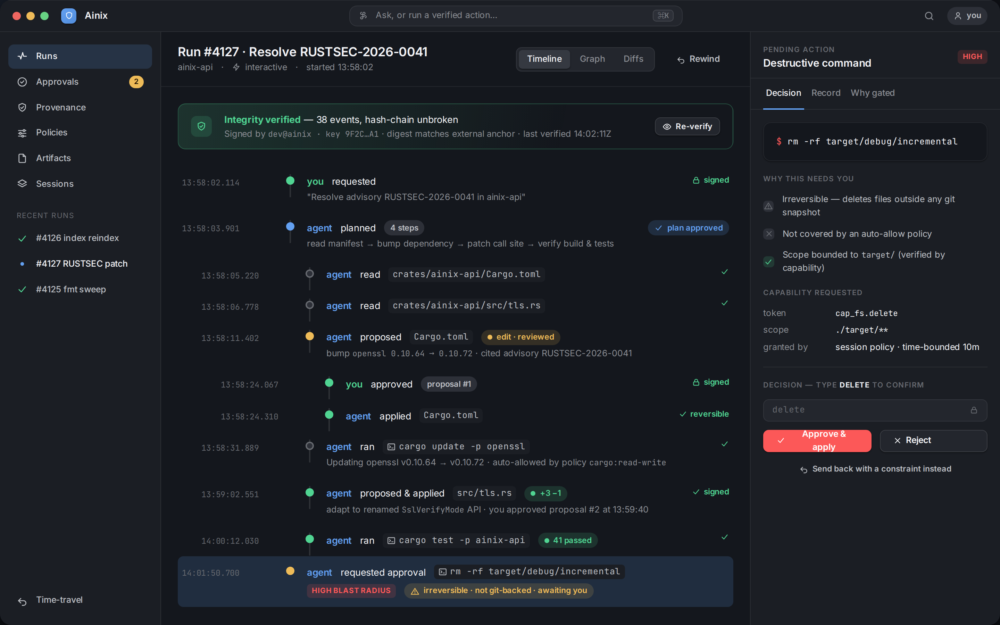
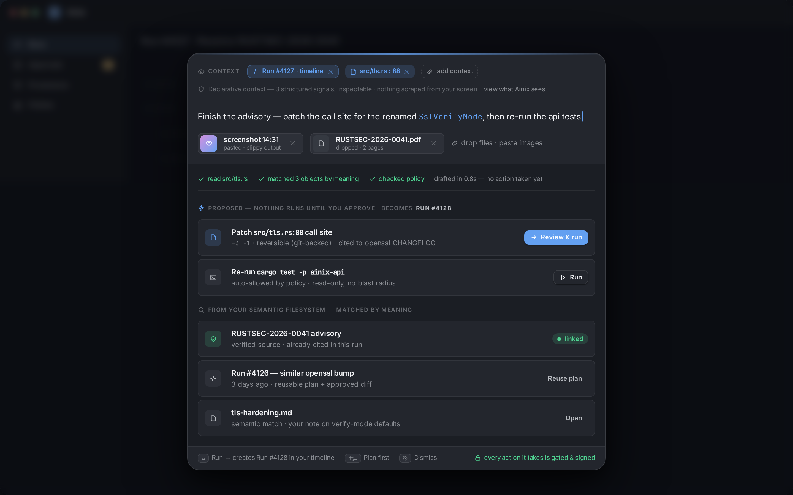
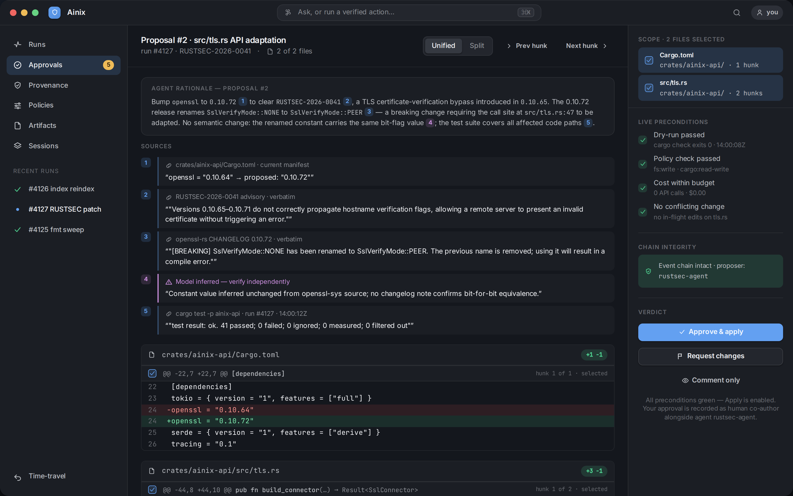

# Ainix

**A verifiable agent control surface — on the path to an agent-native OS.**

When a software agent reads your files, edits a repository, runs a command, or
calls a tool, you should be able to answer — without trusting the agent's own
word for it — *what did it do, with what authority, on what evidence, and can I
prove it?* Ainix makes that the center of the product: every meaningful action is
**capability-authorized, recorded as a signed event, gated by your approval, and
independently verifiable.**

It is an early-stage project. This public repository shares the direction, the
interface vision, and the architecture at a high level while the implementation
matures privately.

## Why this, why now

Agentic tools are racing ahead on capability and falling behind on *control*.
The recurring, well-documented pain is the same everywhere: black-box autonomy,
approval fatigue that trains people to rubber-stamp, undo that doesn't cover the
dangerous cases, and no trustworthy record of what actually happened. The
market keeps reaching for the same primitives — per-action authorization,
blast-radius-aware gating, a tamper-evident record, agent-vs-human provenance —
and keeps getting them as bolted-on add-ons.

Ainix's bet: make verifiability **native and legible**, not an afterthought. The
single hardest-won lesson in this space is that *you cannot trust an agent's own
account of what it did* — so you need an independent, tamper-evident record, and
a surface that makes it real.

## Two halves of one loop

Everything is one loop — **propose → approve → apply → record → verify** — seen
from two ends:

- **Act** — where actions are *born*. A **work surface** ("Summon") that is
  ambient and screen-aware rather than a chat box, and a **semantic filesystem**
  where your content is unified by meaning and provenance instead of folders.
- **Verify** — where actions are *checked*. A run timeline, an approval inbox,
  diff-first review with verbatim citations, policy & capability controls, a
  provenance explorer, cryptographic per-event proof, and an on-demand
  relationship graph.

The work surface is the front door of the same gated pipeline — what you task
flows straight into approval and onto the timeline.

| | |
|---|---|
|  |  |

**See the full vision deck:** [`assets/ui-deck/`](assets/ui-deck/) — ten
high-fidelity surfaces (open `index.html`). It is built on a real design-token
system in the spirit of Pop!_OS COSMIC and elementaryOS: calm, modern, and
deliberately lightweight.

> The interface images here are **mockups**, not screenshots of shipping
> software. The verifiability language is kept honest: a signature attests
> *custody and identity*, never that an action was *correct*.

## What Ainix treats as primitives

- **Cryptographic identity & delegated authority** — users, devices, agents, and
  shared spaces are first-class actors.
- **Capability-scoped agents & extensions** — no ambient authority; actors operate
  through explicit, scoped grants over specific resources.
- **Append-only event provenance** — meaningful actions are recorded as a
  tamper-evident, signed history you can inspect, replay, and verify.
- **Canonical data (primblocks)** — a byte-exact, content-addressed base-truth
  layer: source files import to deterministic blocks and export back identically,
  with adversarial path/symlink safety. Everything derived stays rebuildable from
  it. See [primblocks](docs/architecture/primblocks.md).
- **Semantic state** — versioned, queryable, provenance-rich knowledge built over
  those canonical records.
- **Local-first operation** — starts without a cloud account; private work stays
  on your machine by default.
- **Model-aware policy** — local and remote models are governed by privacy class,
  scope, cost, and network authority.
- **Act + verify surfaces** — a focused control surface for tasking agents and for
  seeing, approving, and auditing everything they do.

## What is real today

The current implementation is a Rust userspace runtime that runs **on top of
existing operating systems** — proving the model before any kernel, driver, or
compositor work. Working today, internally:

- a local runtime and CLI for identity, capabilities, event provenance, semantic
  import/query, agents, extensions, and sessions;
- canonical, byte-preserving import of source files before any derived state, so
  derived state stays rebuildable and auditable;
- typed broker boundaries for runtime operations, with append-only event
  verification and cross-process concurrency safety;
- an asynchronous multi-session daemon with a scheduler (budget accounting,
  provider-slot admission, cooperative preemption) and real mid-flight
  cancellation;
- a single-executable demo that imports a file, builds semantic context, and has
  an agent propose a cited connection for human approval.

The runtime surface is deliberately **honest**: every exposed command does real
work. Ainix does not ship readiness-gate, audit-record, or claim-document
commands as product theater.

## Roadmap

The strategy: prove the verifiable agent loop on a hosted userspace layer first,
make it *legible* through the control surface, and move lower in the stack only
where the hosted layer proves deeper enforcement is required.

1. **Hosted runtime (done / now)** — identity, capabilities, signed events,
   semantic state, async supervisor with a scheduler.
2. **The verify surface (next)** — the run timeline, approvals, diff-first review,
   provenance, and proof, on the real event log: the wedge made visible.
3. **The act surface (then)** — the Summon work surface and the semantic
   filesystem feeding the same gated pipeline.
4. **Ambient layer & beyond (later)** — grow from a focused app into an
   always-present verification layer (status panel, global approval gate, command
   palette), and — the long arc — selective native-system work where it earns its
   place.

See [docs/roadmap/roadmap.md](docs/roadmap/roadmap.md) for detail.

## On the path to an agent-native OS

The near-term product is narrow and honest: a verifiable agent control surface
you can actually use. The long arc is bigger — agents should not live inside apps
forever; they need an operating environment designed for them, and for the people
who stay in control. Ainix is built so the focused surface can grow into that
ambient, system-level layer over time — without over-promising an operating
system before the wedge earns it.

## Public materials

- [UI vision deck](assets/ui-deck/) — the ten surfaces (act + verify)
- [Architecture overview](docs/architecture/overview.md)
- [UI direction](docs/design/ui.md)
- [Primblocks: canonical data](docs/architecture/primblocks.md)
- [Vision / SPEC excerpt](docs/spec/spec-excerpt.md)
- [Roadmap](docs/roadmap/roadmap.md)
- [Development updates](docs/updates/README.md)
- [Article: From Theater to First Blood](docs/articles/2026-06-12-from-theater-to-first-blood.md)

## What Ainix is not (yet)

Ainix is an early-stage project, not a shipping product. It is **not** currently a
consumer app, public SDK, operating-system replacement, downloadable desktop
environment, app marketplace, or production GUI. The interface images here are
**mockups and vision**, not screenshots of working software. The current
direction is a **desktop 2D** surface; spatial/AR/VR, touch, and mobile form
factors are out of scope (see [`assets/archive/`](assets/archive/) for retired
concepts).

## Visual assets

- `assets/ui-deck/` — the UI vision deck: high-fidelity mockups on a real
  design-token system. Mockups, not shipping software.
- `assets/concept-renders/` — generated explainer diagrams (today's surface,
  architecture, roadmap). Reproducible via `scripts/render-concepts.py`.
- `assets/development-updates/` — **real**, dated screenshots of earlier prototypes.
- `assets/press/` — vision/press renders. Concept images, not product screenshots.
- `assets/archive/` — superseded concepts (AR/VR, touch, mobile, infinite canvas).
