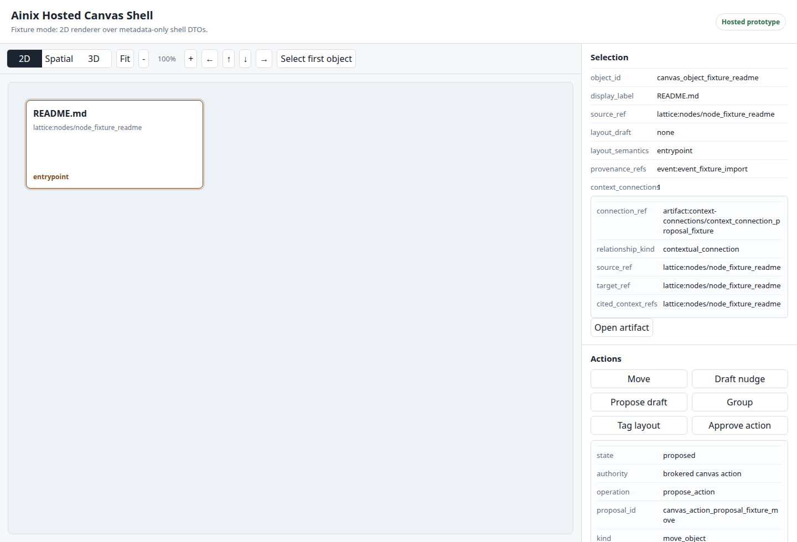
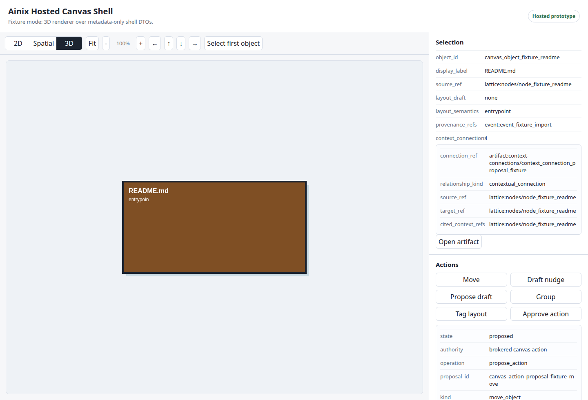

# 2026-06-05 Development Update

Status: current roadmap checkpoint from the private implementation repo. This is
not a public-preview release announcement.

Ainix has completed a major internal roadmap checkpoint. The private
implementation now has the spine of the hosted userspace runtime: brokered
authority, event provenance, semantic lattice import, persistent canvas
projection, hosted shell UI contracts, private-preview packaging controls, a
spatial renderer baseline, and the first single-executable semantic shell demo
path.

## What Is Working Internally

- A local Rust `ainix` CLI and runtime substrate for identity, capabilities,
  event provenance, lattice import/query, canvas records, agents, extensions,
  devices, sessions, and system-boundary requests.
- Typed broker boundaries for session, shell, model, context, storage, event,
  canvas, presence, collaboration, extension, and artifact operations.
- JSON at the CLI/local API edge, with typed DTOs inside the runtime boundary.
- Append-only event verification for the single-executable demo store.
- A hosted canvas shell UI prototype that renders brokered shell/canvas state,
  provenance references, policy state, action proposals, approval/application
  records, search/history, presence, collaboration, and shared-space metadata.
- A renderer-neutral canvas adapter with DOM 2D, DOM spatial, and opt-in
  Three.js projections over the same brokered DTO frame.
- Public-preview candidate tooling that verifies manifests, stages bundles,
  records local evidence, and refuses to claim release readiness until external
  release controls are complete.

## Current Prototype Screenshots

These screenshots are live captures from the private hosted shell UI prototype.
They are not production GUI screenshots and do not imply a public preview
release.



The hosted shell UI currently renders fixture or trusted-bridge shell snapshots
through brokered DTOs. The right inspector shows object identity, source refs,
layout semantics, provenance refs, and context-connection metadata. Canvas
actions remain proposal/approval/application flows rather than direct mutation.



The Three.js path is an opt-in renderer adapter. It is useful as an early
spatial-canvas proof, but it is not production 3D, AR, VR, native shell, or
desktop-replacement functionality.

## Single-Executable Semantic Shell Demo

The next product-shaped path is now scaffolded around one local executable:

```text
select a file or directory
-> import through the primblocks/lattice path
-> build semantic context
-> project into a brokered shell/canvas snapshot
-> let an agent propose contextual connections
-> approve/apply through audited runtime authority
```

The current private implementation exposes this as:

- `ainix shell-demo plan --input <path>`
- `ainix shell-demo run --dry-run --input <path>`
- `ainix shell-demo run --input <path> --store <store>`

The executing demo path is bounded. It validates a selected file or directory,
imports selected content, registers a local echo model, builds a semantic index,
runs a semantic query with cited context refs, spawns a local context agent,
projects imported content into a canvas/shell snapshot, creates a typed
context-connection proposal, approves/applies it, and verifies the resulting
event chain.

The crisp technical artifact here is the primblocks-to-shell chain:
[Primblocks and canonical data](../architecture/primblocks.md) shows a current
demo excerpt where `pipeline-note.md` becomes a canonical `block_<blake3>`
record, a lattice `file_artifact` node, a `backed_by_block` relationship, a
shell canvas object, and a cited context reference for an agent-proposed
connection.

## Why This Architecture Matters

One target workflow is a relationship and pipeline memory agent:

```text
Slack, email, CRM, meeting notes, and professional-network context
-> brokered ingestion with explicit permissions
-> semantic timeline per company, person, opportunity, and thread
-> cited context for the current pipeline state
-> agent proposes follow-ups, reminders, and next actions
-> human approval before messages, CRM writes, or sensitive updates
```

This is the kind of use case Ainix is designed to support. The important part is
not simply connecting to many tools. The important part is giving the agent a
permissioned semantic memory of correspondence, tying every suggested action to
cited context, and preserving an event trail for what was read, inferred,
proposed, approved, and applied.

The private runtime primitives that make this plausible are already present:
capability-scoped access, brokered local API operations, semantic lattice
records, provenance events, context queries, agent proposals, approval/apply
flows, and shell/canvas projection. Product connectors for tools such as chat,
email, CRM, notes, and professional networks remain future integration work and
would need explicit user authorization, least-privilege scopes, retention rules,
and source-specific privacy boundaries.

## Release Boundary

The private implementation has release-gate tooling, but the current state is
still intentionally no-claim:

```json
{
  "release_readiness_status": "blocked",
  "public_preview_release_claim": "not_claimed"
}
```

The remaining public-preview release blockers are publication controls, not
runtime feature work:

- clean source-root git checkout for a release candidate;
- selected immutable release-candidate commit bound to the manifest
  `source_revision`;
- final manifest SHA-256 binding in the controls record;
- external evidence path plus evidence SHA-256;
- final release decision preflight and announcement SHA-256.

## What This Is Not

This checkpoint does not claim:

- public-preview release availability;
- production GUI readiness;
- native shell, compositor, desktop replacement, or operating-system
  replacement;
- full infinite canvas acceptance;
- production 3D, AR, or VR runtime;
- marketplace or third-party extension distribution.

## What Comes Next

The highest-value next public story is a solid demo prototype around the
single-executable semantic shell path: drop or select a file, convert it through
the primblocks/lattice model under capability control, project it into the
semantic shell, and show an agent building contextual connections from cited
semantic evidence.

After that, the public-preview release controls can be closed against a clean
release candidate and external evidence bundle.
